# 基于springboot的企业oa管理系统

<h4 style='color:red'>联系不到我，就看我的主页 </h4> 
 
#### 介绍

基于Spring Boot的企业OA（办公自动化）管理系统，旨在提高企业内部的管理效率和办公协同水平。该系统设计了两种角色：管理员和用户。通过详细的功能模块划分，系统为企业管理者和员工提供了便捷的办公支持，实现了信息化、自动化的办公流程。

#### 技术栈

后端技术栈：Springboot+Mysql+Maven

前端技术栈：Vue+Html+Css+Javascript+ElementUI

开发工具：Idea+Vscode+Navicate

#### 系统功能介绍

管理员角色功能模块  
个人中心：管理员可以在个人中心查看和管理个人信息，修改密码，查看系统通知和消息。  
用户管理：管理员可以添加、修改、删除和查看系统用户的信息，分配用户权限。  
公告信息管理：管理员可以发布和管理企业内部公告，确保重要信息及时传达给所有用户。  
客户关系管理：管理员可以管理客户信息，记录客户的联系信息、历史交易记录和跟进情况，帮助企业维护客户关系。  
通讯录管理：管理员可以维护企业内部通讯录，方便员工之间的联系和沟通。  
日程安排管理：管理员可以管理企业内部的日程安排，记录重要会议和活动，提醒相关人员。  
车辆信息管理：管理员可以管理企业的车辆信息，记录车辆的使用情况、维护记录和预约情况。  
文件信息管理：管理员可以上传、下载和管理企业的文件资料，确保文件的有序管理和安全存储。  
工作日志管理：管理员可以查看和管理员工的工作日志，了解员工的工作进展和任务完成情况。  
上班考勤管理：管理员可以管理员工的上班考勤记录，统计员工的出勤情况，生成考勤报表。  
工资信息管理：管理员可以管理和查看员工的工资信息，生成工资报表，确保工资发放的准确性和及时性。  

用户角色功能模块  
个人中心：用户可以在个人中心查看和管理个人信息，修改密码，查看系统通知和消息。  
公告信息管理：用户可以查看企业发布的公告信息，了解企业的最新动态和重要通知。  
客户关系管理：用户可以管理自己负责的客户信息，记录客户的联系信息和跟进情况，维护客户关系。  
通讯录管理：用户可以查看企业内部通讯录，方便与其他员工的联系和沟通。  
日程安排管理：用户可以查看和管理个人的日程安排，记录重要会议和活动，设置提醒。  
车辆信息管理：用户可以查看企业的车辆信息，预约使用车辆，记录使用情况。  
文件信息管理：用户可以上传、下载和管理自己的文件资料，确保文件的有序管理和安全存储。  
工作日志管理：用户可以记录和管理自己的工作日志，记录每天的工作内容和任务完成情况。  
上班考勤管理：用户可以查看自己的上班考勤记录，了解自己的出勤情况。  
工资信息管理：用户可以查看自己的工资信息，了解工资发放情况和详细信息。  

#### 系统作用

该系统的主要作用包括：

提高管理效率：通过信息化手段，系统实现了用户管理、公告信息管理、客户关系管理、通讯录管理、日程安排管理、车辆信息管理、文件信息管理、工作日志管理、上班考勤管理和工资信息管理的自动化处理，减少了人工操作，提高了管理效率。  
增强信息交流：系统为企业内部提供了一个高效的信息交流平台，确保重要信息能够及时传达到每个用户，提高了信息传递的速度和准确性。  
优化资源管理：系统通过对客户关系、车辆信息、文件资料和员工工作日志的管理，帮助企业优化资源配置，提高资源使用效率。  
提升员工满意度：系统为员工提供了便捷的个人信息管理、日程安排管理和工资信息查询功能，提高了员工的工作体验和满意度。  

#### 系统功能截图

代码结构

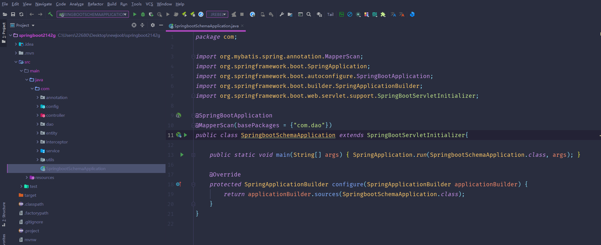

数据库表

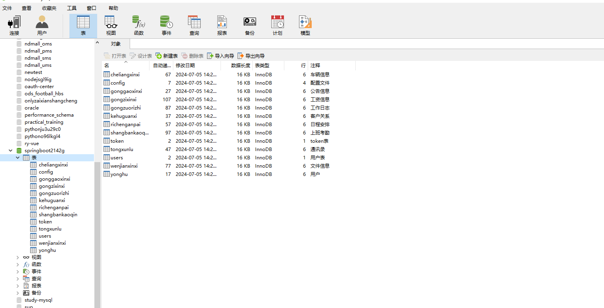

登录

用户端个人信息

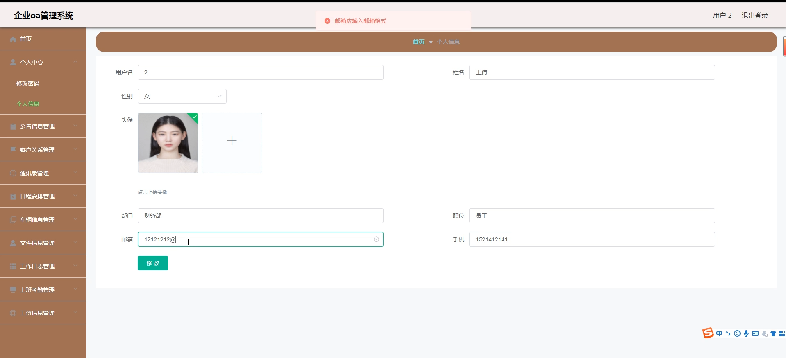

用户管理

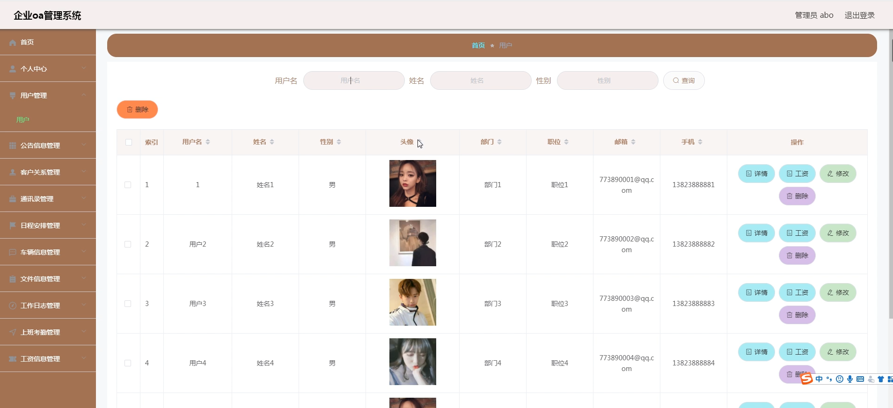

公告信息管理

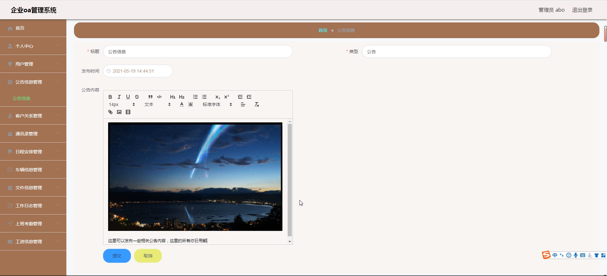

客户关系管理

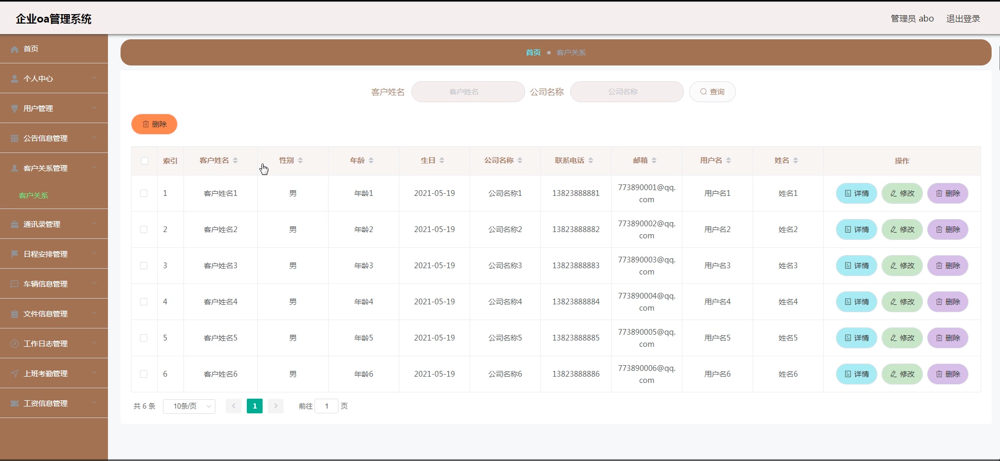

工资信息管理

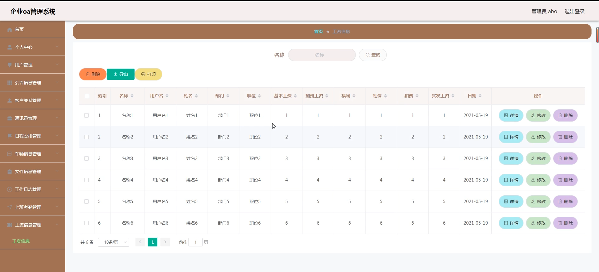

通讯录管理

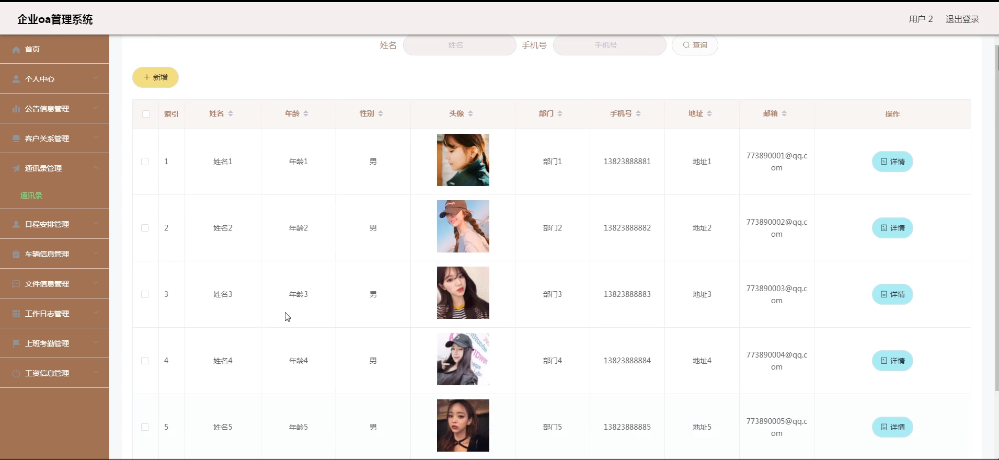

车辆信息管理

工作日志管理

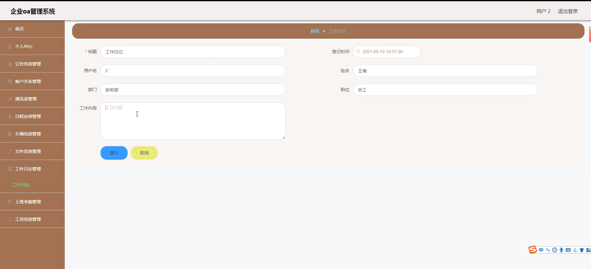

上班考勤管理

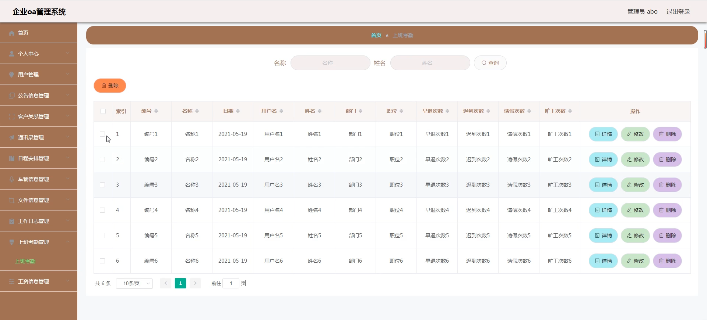

文件信息管理

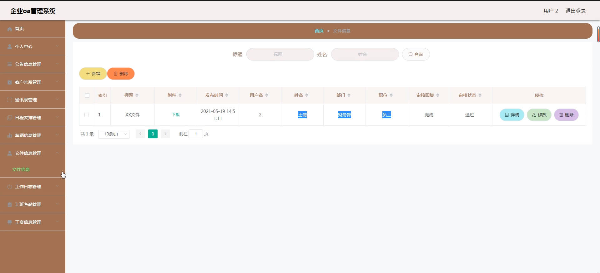

#### 总结

基于Spring Boot的企业OA管理系统通过全面的功能模块设计，实现了企业内部管理的高效化和信息化。系统为管理员和用户提供了全面的功能支持，优化了企业内部的信息交流和资源管理流程。通过该系统，企业管理者能够更好地组织和管理各项工作，提高企业的运营效率；员工则能够方便地管理个人信息、查看公告和日程安排，提升工作效率和满意度。该系统不仅提高了企业的管理水平，还增强了员工的工作体验，为企业的发展提供了有力支持。

#### 使用说明

创建数据库，执行数据库脚本 修改jdbc数据库连接参数 下载安装maven依赖jar 启动idea中的springboot项目

后台地址：http://localhost:8080/springboot2142g/admin/dist/index.html

管理员  abo 密码 abo
